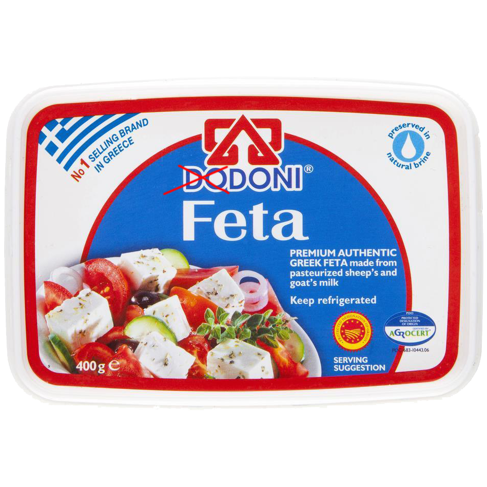

<div style="display: flex; justify-content: center;">
  
</div>

# pydoni

> A superior Python package written by Doni.

---

```
Author         : Andoni Sooklaris  
Language       : Python
Started Date   : 2018-11-25
Completed Date : <in progress>
```

## Sub-Modules

#### `db`
> Database. Addresses interacting with MySQL and PostgreSQL databases.

#### `os`
> Operating System. Addresses handling files on the filesystem.

#### `pyobj`
> Python Objects. Addresses recurrent handling methods on Python objects.

#### `sh`
> Shell. Python wrappers for BASH functions or programs.

#### `vb`
> Verbose. Addresses the verbose output of programs ot stdout.

#### `web`
> Web. Addresses webscraping, parsing web documents, or any other web-related calls from Python.

#### `classes`
> Houses all pydoni class objects.

---

## Changelog
### v1.0.0 - 2019-01-12

* Initial release!

## License

[](http://badges.mit-license.org)

- **[MIT license](http://opensource.org/licenses/mit-license.php)**
- Copyright 2019 © **Andoni Sooklaris**